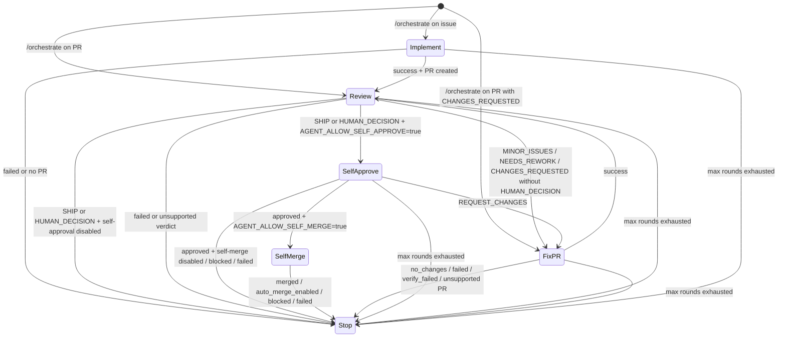

The orchestrator is an explicit high-level route (`/orchestrate` or `agent/orchestrate`) that evaluates current target state and dispatches the most appropriate built-in next action.

Configure `AGENT_AUTOMATION_MODE` to choose how orchestrator handoffs are decided. The packaged entry workflows default to `agent`; set `heuristics` for deterministic routing with lower model cost:

| Mode | Meaning |
|---|---|
| `heuristics` | Deterministic built-in state machine. |
| `agent` | Planner-assisted orchestration, validated by runtime policy. |

Set `AGENT_AUTOMATION_MAX_ROUNDS` to cap the chain length. The default cap is 12 rounds.

## Current heuristics state machine

The orchestrator supports an explicit manual start plus the existing bounded handoff policy:

When the route starts, the router dispatches `agent-orchestrator.yml` with:

- source action (`orchestrate`)
- target kind (`issue` or `pull_request`)
- target number
- requester and request text
- current round and max rounds
- optional `base_branch` or `base_pr` for stacked implementation PRs

Each action workflow launched by `agent-orchestrator.yml` receives
`orchestration_enabled: true`. Only runs with that explicit context hand back to
the orchestrator after post-processing; direct `/implement`, `/review`, and
`/fix-pr` runs, plus manual `agent-self-approve.yml` and
`agent-self-merge.yml` runs, keep the default `orchestration_enabled: false`
and stop after their own workflow. For
orchestrator-launched fix-pr runs, the completion status comment attributes the
visible request mention to the configured agent handle (`AGENT_HANDLE`, default
`@sepo-agent`) instead of re-tagging the original human requester.

When an action-originated handoff is used, the orchestrator also accepts:

- source action
- source conclusion
- source recommended next step, when the source is review synthesis
- target issue or pull request number
- next target number when implementation opened a pull request
- source workflow run ID for duplicate-dispatch detection
- optional source handoff context for downstream task text
- current round and max rounds
- requester and request text to carry forward

In `heuristics` mode, manual starts use deterministic status checks:

- issue target: dispatch `implement`
- pull request target with `CHANGES_REQUESTED`: dispatch `fix-pr`
- other open pull request targets: dispatch `review`

In `agent` mode, a manual start can ask the planner to choose the first
orchestration step. For issue targets, the planner can dispatch `implement`
directly for a small, self-contained change on the current issue, or act as a
meta-orchestrator when a separate child issue materially helps. For direct
implementation, the planner returns `handoff` with `next_action: "implement"`,
and the dispatcher launches `agent-implement.yml` for the current issue. For PR
targets, the planner can return `handoff` with `next_action: "review"` or
`next_action: "fix-pr"` after parsing the user's request text; runtime policy
checks that the PR is open and rejects PR starts that try to dispatch
`implement` or `delegate_issue`. The planner may also return `answer`, `stop`,
or `blocked` when no follow-up workflow should run.

Issue targets labeled `agent-goal` are parent objectives rather than ordinary
implementation tasks. The planner should use the goal body, success criteria,
subgoals, linked work, and existing sub-issues to choose one bounded next step.
When the next step is non-trivial or represents a distinct subgoal, prefer
`delegate_issue` so the child can run the normal implementation/review/fix
chain. Use a direct `implement` handoff only when the goal issue itself already
describes a small, concrete, self-contained change. Stop or block when the goal's
success criteria or next subgoal require human direction.

For child work, the planner may return `delegate_issue`, which is an internal
command rather than a public route. The dispatcher creates or reuses one child
issue for the requested stage and dispatches `agent-orchestrator.yml` for the
child issue in heuristic mode. New agent-created child issues store a hidden
`sepo-sub-orchestrator` marker in the issue body. Existing user-authored issues
can also be adopted when the planner provides `child_issue_number`; adoption
stores the marker in an agent-authored child issue comment instead of editing or
trusting the user-authored body. After recording the trusted parent/child marker
on the parent issue, the dispatcher also best-effort links the child through
GitHub's sub-issue REST API when that endpoint is available. If the API is
unavailable or rejects the link, the marker/comment relation remains the durable
fallback and child orchestration continues. The child issue then follows the
normal bounded chain of `implement`, `review`, `fix-pr`, and, when enabled,
`agent-self-approve` and `agent-self-merge` runs. The public route remains
`/orchestrate`; the internal command keeps child delegation separate from
concrete follow-up actions such as `implement`, `review`, `fix-pr`,
`agent-self-approve`, and `agent-self-merge`.

When the meta-orchestrator continues sequential child implementation work after
a prior child produced an open, unmerged PR, the planner should set `base_pr` to
that prior child PR unless the next child is intentionally independent.
When a stacked parent PR is merged, branch cleanup retargets open child PRs from
the merged parent branch to the parent's base branch before deleting the parent
branch.

Child issue metadata is intentionally GitHub-visible state, not session state.
The parent issue keeps the meta planner session, while each child issue gets its
own normal issue target identity. When the child reaches a terminal stop, the
handoff dispatcher resolves the trusted child marker from the child issue body or
from agent-authored child issue comments, or through a closing issue reference in
the terminal PR body. These trust checks normalize GitHub App actor variants such
as `app/sepo-agent-app`, `sepo-agent-app[bot]`, and `sepo-agent-app` to the same
actor. It then writes a parent progress comment, dispatches the parent issue
orchestrator in agent mode with the child result, and marks the same trusted
child marker as `done`, `blocked`, or `failed`. The progress
comment includes a compact transposed Markdown table for the visible status and
a hidden resume marker so reruns can recover a pending report or skip an
already-dispatched terminal report. Child selection and adoption comments use
the same compact table style while preserving their hidden durable markers.
If terminal child metadata is found but rejected by trust checks or cannot be
safely updated, the dispatcher posts a compact stop comment on the current
terminal issue or PR with a hidden dedupe marker. Ordinary terminal PR stops
without sub-orchestrator metadata remain silent.
If the resumed parent planner decides there is no next child or action, the
parent run posts a terminal stop comment on the parent issue with the source
conclusion, target, round, reason, and hidden `sepo-agent-orchestrate-stop`
marker. Exact trusted duplicates are skipped on reruns.
When the planner returns `blocked` with `user_message` or
`clarification_request`, that same terminal comment surfaces the planner's
question directly and the chain pauses without dispatching an `answer` route.

Initial user-launched `/orchestrate` requests validate that the requester has
access to the delegated route capability set before dispatching work. When
`AGENT_ALLOW_SELF_APPROVE=true`, that set includes `agent-self-approve`; when
both `AGENT_ALLOW_SELF_APPROVE=true` and `AGENT_ALLOW_SELF_MERGE=true`, it also
includes `agent-self-merge`. Disabled self-approval or self-merge routes are not
part of the delegated capability check. This keeps authorization at the user
boundary: child and parent resume dispatches preserve `requested_by` for
traceability, but they do not need to thread requester association and route
policy through every downstream workflow.

When an orchestrator dispatches `implement`, it forwards any planner-provided
or explicit `base_branch` or `base_pr` input. `agent-implement.yml` then
resolves a single base branch: `base_branch` is used when set, `base_pr`
resolves to the open same-repository PR head branch, and the repository default
branch is used when neither input is present. Setting both base inputs is
rejected.

Manual pull request starts are deterministic only in `heuristics` mode. In
`agent` mode, issue-level and pull-request-level manual starts may invoke the
planner for the first orchestration step, and action-originated handoff
envelopes use the planner path when enabled.

In `heuristics` mode, action-originated handoff decisions still use the fixed transition policy and round budget checks.

Review-originated `fix-pr` handoffs carry explicit task context when available. The review dispatcher derives it from the latest review synthesis action items, and heuristic mode falls back to a conservative instruction to address only unresolved review synthesis action items while ignoring optional INFO notes and metadata-only polish. When a review synthesis recommends `HUMAN_DECISION`, self-approval-enabled orchestration routes to `agent-self-approve` instead of `fix-pr` or a human stop; self-approval then decides whether to approve, request changes, or block. Manual PR `/orchestrate` starts with a `CHANGES_REQUESTED` review decision use separate context that tells `fix-pr` to address the latest unresolved requested-change review comments instead of the review-synthesis fallback. Self-approval `REQUEST_CHANGES` handoffs preserve the approval agent's handoff context as the `fix-pr` task. Self-approval `APPROVED` handoffs dispatch `agent-self-merge` only when `AGENT_ALLOW_SELF_MERGE=true`.

In `agent` mode, the orchestrator first runs a scoped planner prompt through the same resolved-provider runtime used by other agent actions. The planner has its own `orchestrator` route and `planner` lane, so session continuation is separate from implement, review, and fix-pr sessions. The planner runs with `approve-all` tool permission so it can gather current GitHub and repository context in non-interactive workflows. It still receives read-only repository memory, selected read-only rubrics, the handoff envelope, any source handoff context, and original request, and returns JSON describing whether to stop, block, delegate a child issue, or hand off. For blocked decisions, the planner may return `user_message` or `clarification_request` to ask for missing context in the visible stop comment. For handoffs, the planner may also return `handoff_context`: explicit, action-oriented instructions for the next workflow. When the next action is `fix-pr`, the dispatcher passes that context into `agent-fix-pr.yml`, and the fix-pr prompt treats it as the selected task and constraints for the automated fix pass. The workflow uses the runtime preflight CLI to skip this planner when the max-round budget is already exhausted or the initial requester lacks delegated-route capability, and the runtime still validates planner JSON against the fixed transition policy, the issue-only direct-implement rule, and max-round budget before dispatching anything.

When an orchestrator-launched `implement` or `fix-pr` run reports
`no_changes`, `failed`, `verify_failed`, or `unsupported`, the dispatcher stops
and posts a structured stop comment on the current target with the source
action, conclusion, target, round, reason, and source run ID. Planner-originated
parent stops use the same structured stop format. For `fix-pr`, the runtime does
not re-review automatically after those conclusions; `fix-pr` must succeed
before the chain can hand back to `review`.

Before dispatching, the orchestrator checks for a hidden handoff marker on the destination issue or pull request. It then writes a compact visible status comment with a transposed table for source, next action, target, round, and status, plus an explicit `Task for fix-pr` block for fix-pr handoffs. The hidden marker still records the current source run, source action, destination action, target, and round. The orchestrator writes a `pending` marker, dispatches the next workflow, and updates the marker to `dispatched` after `workflow_dispatch` succeeds. After a successful dispatch, it minimizes older visible handoff marker comments from the same authenticated agent account as outdated unless `AGENT_COLLAPSE_OLD_REVIEWS=false` is set. If dispatch fails, the marker is updated to `failed` so a rerun can retry. Rerunning the same source action or orchestrator run skips fresh `pending` or `dispatched` markers instead of enqueueing a duplicate next action. A `pending` marker records its creation time; if it is older than the one-hour stale threshold, the orchestrator marks it `failed` and retries so cancelled runs do not permanently block handoff. Non-success statuses and unsupported verdicts stop the chain.

## Permission note

`agent-orchestrator.yml` requests `actions: write` because `workflow_dispatch` requires it, and `issues: write` to persist dedupe markers on destination issues or pull requests.

## Extension path

The orchestration boundary is deliberately small: richer agent planning can expand behind the same explicit route while keeping budget checks, dedupe markers, and dispatch validation in runtime code. Runtime policy should continue to enforce allowed transitions and max rounds even when a planner suggests the next action.
