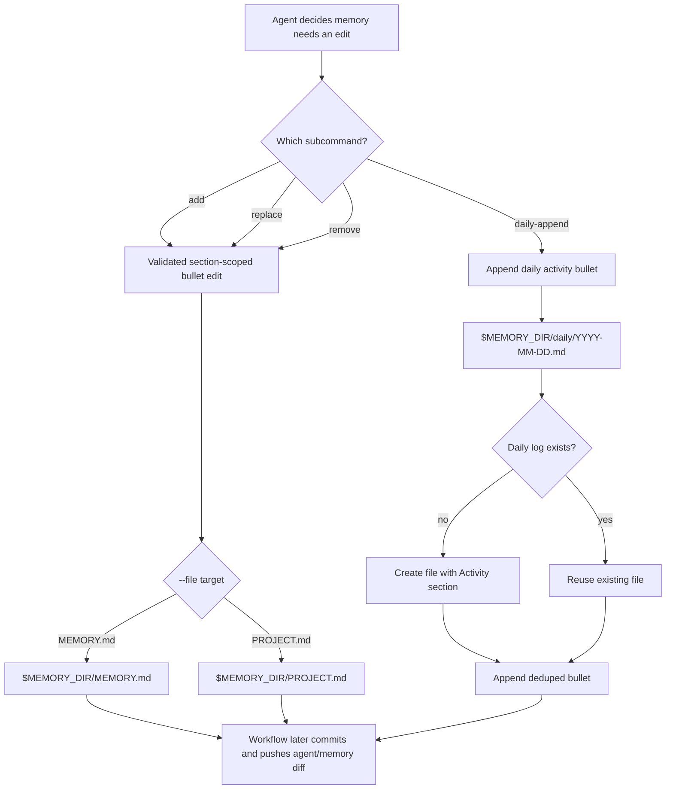

The agent composes long-lived memory across runs on a dedicated `agent/memory` branch. Memory is **agentic**: the main agent (on `answer`, `implement`, `fix-pr`, `review`, `skill`) reads and writes memory directly during normal tasks, using a pair of CLIs. Dedicated scheduled workflows curate memory outside user-driven work.

Memory is separate from [user/team rubrics](rubrics.md). Memory captures agent/project continuity and lessons the agent uses to improve its own work; rubrics capture normative user preferences used to steer implementation and score reviews.

## Branch layout

| Path | Purpose |
|---|---|
| `PROJECT.md` | Slow-changing project context: goals, constraints, open questions |
| `MEMORY.md` | Durable learned conventions and lessons the agent should carry forward |
| `daily/YYYY-MM-DD.md` | Append-only daily bullets composed by the agent |
| `github/<owner>/<repo>/{issue,pull,discussion}-<id>.json` | Deterministic mirror of repo history, written by `agent-memory-sync.yml` |

These are the seeded anchor files, not an exhaustive schema; the memory tree may also contain additional agent-created notes when that helps organize durable context.

Markdown where humans curate (PROJECT / MEMORY / daily); raw `gh --json` output where the mirror just dumps. The `github/` layout is repo-namespaced so copied memory branches can retain old repo history while new syncs write into the current repo's namespace. Each namespace uses a `<type>-<id>.json` filename so issue #42, PR #42, and discussion #42 never collide — GitHub shares the issue/PR counter, and discussions use their own.

Notes can cite mirrored artifacts with backlink-style paths, for example `[[github/self-evolving/repo/issue-238.json]]`.

Previous adopters with flat artifacts such as `github/issue-*.json`, `github/pull-*.json`, or `github/discussion-*.json` should manually move active artifacts under the matching `github/<owner>/<repo>/` namespace or delete stale copied artifacts. Sepo does not automatically mutate the legacy flat layout, and `memory/search.js` searches recursively, so leftover flat artifacts can still appear in search results and mix old and new repository context.

The mirror preserves exactly what `gh` returns so the agent can query with `jq`:

```bash
jq '.comments[].body' "$MEMORY_DIR/github/self-evolving/repo/issue-209.json"
jq 'select(.state == "MERGED") | .title' "$MEMORY_DIR/github/self-evolving/repo/pull-"*.json
```

`memory/search.js` already handles `.json` files, so tokenized text search still works on field values.

Sync cursors for the mirror live in a separate ref, `refs/agent-memory-state/sync`, so cursor updates don't pollute the memory branch's commit history. This follows the same ref-backed state pattern used by session continuity thread state: operational cursor state stays off the human-facing memory branch. The state records `repo_slug`; if a copied branch carries state for another repository, the read/write CLIs ignore it and start a fresh cursor for the current repo.

## Memory CLIs

Main routes mount the memory branch at `$MEMORY_DIR` and expose two CLIs to the agent:

| CLI | Purpose |
|---|---|
| `node .agent/dist/cli/memory/search.js --dir "$MEMORY_DIR" "<query>"` | Tokenized filesystem search with snippets |
| `node .agent/dist/cli/memory/update.js <add\|replace\|remove\|daily-append> --dir "$MEMORY_DIR" [...]` | Validated helper for bullet-level edits to `MEMORY.md` / `PROJECT.md` / `daily/*.md` |

The agent can read and edit files under `$MEMORY_DIR` with normal tools. For standard bullet-oriented changes, `memory/update.js` is the preferred helper because it keeps section placement, formatting, and dedup consistent. The outer workflow commits any resulting diff to `agent/memory` using the workflow's token — the agent never needs push access.

### How `memory/update.js` changes files



File impact is intentionally narrow:

- `add`, `replace`, and `remove` change exactly one file: `$MEMORY_DIR/MEMORY.md` or `$MEMORY_DIR/PROJECT.md`.
- `daily-append` changes exactly one dated log: `$MEMORY_DIR/daily/YYYY-MM-DD.md`, creating it first when missing.
- `memory/update.js` never mutates `github/<owner>/<repo>/*.json`; those files only change during the deterministic mirror sync.
- Agents may also edit repo-local memory files directly when they need a shape the CLI does not cover; the CLI is the safe default for simple bullet updates.

### `update.js` outcomes

The CLI exits 0 on success (stdout) and 2 on caller-fixable errors (stderr). `replace` has two success shapes worth calling out:

| Result | Meaning | Action |
|---|---|---|
| `replaced bullet in <file>` | `--match` resolved to a single bullet; `--with` is novel | source line rewritten |
| `collapsed duplicate bullet in <file>` (`deduped`) | `--match` resolved, but `--with` already exists as a distinct bullet | source line removed, existing target kept (net: one fewer bullet, no duplicate) |
| `no change (duplicate): <file>` (`noop`) | `--match` resolved to a bullet that already equals `--with` | no write |
| `no bullet matched: <match> in <file>` | `--match` found nothing | exit 2 |
| `multiple bullets matched: <match> in <file>` | `--match` resolved to ≥2 *distinct* bullets | exit 2, stderr lists candidates; the agent should refine `--match` |

`remove` uses the same matching rules: single-match removes, multi-match refuses with `ambiguous_match`, zero-match refuses with `missing_match`.

Non-LLM support CLIs used by the scheduled workflows:

| CLI | Purpose |
|---|---|
| `memory/bootstrap-branch.js` | Local helper that creates or updates a local `agent/memory` branch and seeds the memory tree |
| `memory/sync-github-artifacts.js` | Mirrors issues, PRs, and discussions into `github/<owner>/<repo>/*.json` |
| `memory/read-sync-state.js` / `memory/write-sync-state.js` | Read and write cursors stored at `refs/agent-memory-state/sync` |
| `memory/resolve-policy.js` | Internal to `run-agent-task`; resolves the effective memory mode per run |

## Workflows

Four workflows complement the main execution routes:

| Workflow | Trigger | Purpose | LLM |
|---|---|---|---|
| `agent-memory-bootstrap.yml` (`Agent / Memory / Initialization`) | `workflow_dispatch` | Initialize `agent/memory` on first run from GitHub Actions, then run the initial sync and scan inline | Auto |
| `agent-memory-sync.yml` (`Agent / Memory / Sync GitHub Artifacts`) | `schedule` (every 6h), `workflow_dispatch` | Deterministic mirror of recent GitHub artifacts | No |
| `agent-memory-pr-closed.yml` (`Agent / Memory / Record PR Closure`) | `pull_request_target.closed`, `workflow_dispatch` | Agent curates memory when a PR closes. Skips unmerged fork PRs (fork safety). | Yes |
| `agent-memory-scan.yml` (`Agent / Memory / Curate Recent Activity`) | `schedule` (every 6h), `workflow_dispatch` | Agent reviews recent activity and curates durable memory | Yes |

`agent-memory-bootstrap.yml` is the explicit setup path for existing repositories: it fails if the memory branch already exists, seeds the anchor files into a fresh `agent/memory` branch, pushes that first commit directly from Actions, then runs the initial sync and scan steps inline to populate the branch.

Both agent-driven scaffolds invoke the same `run-agent-task` action as the main routes. They can use the same memory CLIs and the same normal file-editing tools against the mounted memory checkout.

`agent-memory-scan.yml` is repo-scoped rather than thread-scoped, so it runs with `target_kind: repository`, `target_number: 0`, and the repository URL as its target identity. Scheduled scan runs first check whether the sync activity cursor has advanced since the last successful scan; manual `workflow_dispatch` runs bypass that schedule gate.

The dedicated memory workflows can still bootstrap the memory tree when the branch does not exist yet, so a fresh repo can initialize `agent/memory` on its first sync/curation run even without the explicit bootstrap workflow. Normal routes still degrade gracefully when memory is absent.

## Scheduled workflow policy: `AGENT_SCHEDULE_POLICY`

`AGENT_SCHEDULE_POLICY` is an optional repository variable that controls scheduled workflow runs. It applies only to `schedule` events; manual `workflow_dispatch` runs remain available for debugging and recovery. To pause all Sepo workflow entry points, including manual dispatch, set the global `AGENT_ENABLED` repository variable to `false`.

**Default**: scheduled workflows use `skip_no_updates`, with `agent-daily-summary.yml` set to `disabled` and `agent-memory-sync.yml` set to `always_run`.

**Modes**:

- `always_run` — run every cron tick
- `skip_no_updates` — run only when the workflow's activity detector finds relevant work
- `disabled` — skip cron-triggered work while preserving manual dispatch

**Policy shape**:

```json
{
  "default_mode": "skip_no_updates",
  "workflow_overrides": {
    "agent-daily-summary.yml": "disabled",
    "agent-memory-sync.yml": "always_run"
  }
}
```

Workflow overrides are keyed by workflow filename. Today, `agent-memory-scan.yml` compares `refs/agent-memory-state/sync.last_activity_at` with `refs/agent-memory-state/scan.last_scan_at` and records the scan cursor only after a successful scan. After the sync state has an initial baseline, the sync activity cursor advances only when issue, pull request, or discussion activity is mirrored, so no-op sync runs do not force a scan. `agent-daily-summary.yml` is disabled for scheduled runs by default; when enabled, it currently counts issue, pull request, and discussion signals in its lookback window and skips when that count is zero. It also checks discussion posting availability before signal collection so repositories without discussions, or without the configured discussion category, skip summary generation early. Commit-only activity is not counted yet. `agent-memory-sync.yml` has no external detector, so it should usually be set to `always_run`; if the policy resolves it to `disabled`, the cron run stops before sync work begins.

## Access policy: `AGENT_MEMORY_POLICY`

`AGENT_MEMORY_POLICY` is an optional repository variable that controls which routes can read or write memory. Mirrors the shape of `AGENT_ACCESS_POLICY`.

**Default**: every route gets `enabled` (full read+write).

**Modes**:

- `enabled` — mount memory, commit+push edits after the run
- `read-only` — mount memory, skip the commit step
- `disabled` — skip memory entirely

**Policy shape**:

```json
{
  "default_mode": "enabled",
  "route_overrides": {
    "review": "read-only",
    "dispatch": "disabled"
  }
}
```

Either key is optional. Examples:

- `{"route_overrides": {"review": "read-only"}}` — default-enabled, but review runs don't write
- `{"default_mode": "read-only"}` — nothing writes memory automatically; the dedicated scaffolds still do
- `{"default_mode": "disabled"}` — main routes never touch memory; only the scheduled scaffolds curate

The dedicated memory workflows (`agent-memory-pr-closed.yml`, `agent-memory-scan.yml`) bypass the memory policy by passing `memory_mode_override: 'enabled'` on their `run-agent-task` call, so memory access stays available for curation. Scheduled runs are still governed by `AGENT_SCHEDULE_POLICY`; to stop scheduled scan work while preserving manual dispatch, set a workflow override to `disabled`.

## Execution and security

### Fork safety on PR close

`agent-memory-pr-closed.yml` triggers on `pull_request_target: [closed]`, which runs in the base-repo context with write-scoped tokens. To keep attacker-controlled fork PR content from reaching the LLM with a write token, the job-level `if` restricts execution to:

- same-repo PRs, or
- merged fork PRs (content was reviewed and merged), or
- manual `workflow_dispatch`.

Closed-without-merge fork PRs are skipped.

Merged fork PRs remain a deliberate trust trade-off. The PR title/body/comments/reviews are still user-controlled metadata and some of that metadata can change after merge, but v3 accepts that post-merge input for memory curation rather than dropping fork PRs entirely. If that boundary is too loose for a repository, tighten the workflow to skip fork PRs or reduce the prompt to trusted post-merge signals only.

### Per-job permissions on review

Review is the least-trusted route because it ingests arbitrary PR diffs. `agent-review.yml` keeps the matrix reviewer jobs at `contents: read` and explicitly forces `memory_mode_override: 'read-only'` on them — reviewers can consult memory but can't write.

Only the `synthesize` job gets `contents: write` and uses the default policy-resolved mode. This also avoids the parallel-push race (two reviewer jobs contending for a fast-forward on the same ref) that would otherwise arise from running both `claude-review` and `codex-review` concurrently.

### Memory commit gating

The post-run commit in `run-agent-task` is gated on three conditions, all of which must hold:

1. `steps.run.outputs.exit_code == '0'` — the agent ran cleanly
2. `steps.memory_mode.outputs.write_enabled == 'true'` — policy allows writes
3. `steps.memory.outputs.memory_available == 'true' && memory_dir != ''` — memory was successfully mounted

Failed or interrupted runs never push partial edits.

## Flags on `run-agent-task`

| Input | Purpose |
|---|---|
| `memory_policy` | Policy JSON (overrides `vars.AGENT_MEMORY_POLICY` when passed) |
| `memory_mode_override` | Force a specific mode, bypassing policy. `enabled` is used by memory-scaffold workflows and also bootstraps the memory tree on first use. |
| `memory_ref` | Branch to clone (usually passed as `vars.AGENT_MEMORY_REF` or `agent/memory`) |

The action exposes `memory_mode`, `memory_available`, `memory_dir`, and `memory_committed` as outputs for callers that need to branch on the mode.
