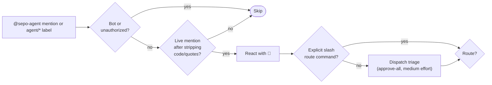
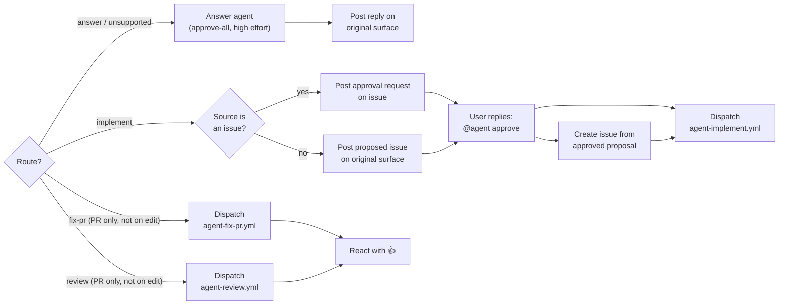

The `.agent` backend exposes a small set of GitHub-native agent workflows. Agent execution goes through the direct `acpx <agent> exec/prompt` path, with session continuity handled by `SessionPolicy` plus git-ref thread state.

## Triggering modes

- **User initiated**
  - mentions in issues, PRs, discussions, and comments
  - labels such as `agent/answer` or `agent/s/<skill>`
- **Workflow initiated**
  - downstream reusable workflows dispatched by the router after route resolution or approval
- **Scheduled or autonomous actions**
  - TODO

Approval comments such as `@sepo-agent /approve <request_id>` are part of the implementation lifecycle rather than a separate top-level trigger mode. See [The life cycle of an agent request](request-lifecycle.md) for that path.

## Portal flow

The first half of the portal flow decides whether the trigger should run at all and, if so, which route it should take.

Once the route is resolved, the backend either answers inline, asks for approval, or dispatches a route-specific workflow.

## Structure

### TypeScript runtime (`.agent/src/`)

All shared modules live flat in `.agent/src/`. CLI entrypoints live in `.agent/src/cli/`. Tests live in `.agent/src/__tests__/`. Package metadata lives in `.agent/package.json` and `.agent/tsconfig.json`.

Long-lived [agent-owned memory](memory.md) and [user-owned rubrics](rubrics.md) are intentionally separate state surfaces: `agent/memory` captures agent/project continuity, while `agent/rubrics` captures normative user/team preferences used for implementation steering and review scoring.
