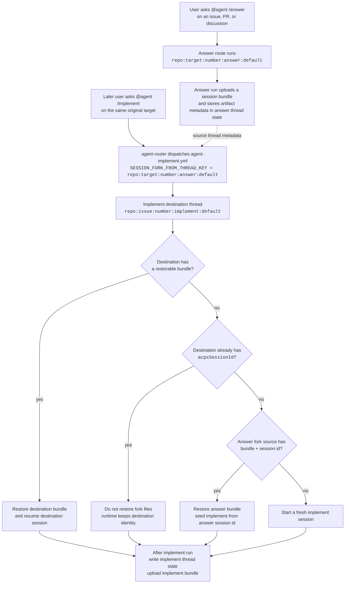

Persistent session continuity can optionally use GitHub Actions artifacts to carry local agent session files across runs. This is useful when the next run lands on a fresh machine and local `HOME` state is not sticky.

## Session policies

The shared `run-agent-task` action accepts `session_policy`:

- `none`: run one-shot with `acpx <agent> exec` and do not write thread state
- `track-only`: run one-shot without a stable named ACP session while still updating thread state for run metadata
- `resume-best-effort`: use a persistent named ACP session when a resumable identity is available, but fall back fresh when continuity cannot be restored
- `resume-required`: use a persistent named ACP session and fail when an existing thread cannot satisfy the continuity requirement

Codex `none` exec runs that receive a configured reasoning effort may create a
fresh per-run ACP session only to apply `thought_level`, because ACPX exposes
that option through session configuration rather than a global exec flag. That
session name is random, is not written as thread state, and is not restored or
reused by later runs.

`track-only` intentionally does not ensure or prompt a stable named ACP session.
Codex `track-only` runs that need a `thought_level` may use a fresh per-run ACP
session to apply that option; `track-only` runs that upload debug bundles also
use a fresh per-run ACP session. Neither path reuses the target/lane session
identity. `track-only` is for jobs that need observability without
conversational continuity, such as review synthesis, reviewer lanes,
self-approval checks, and scheduled one-shot actions.

## Session bundle modes

The shared `run-agent-task` action accepts `session_bundle_mode`:

- `never`: disable bundle restore and backup
- `auto`: enable restore and backup only for routes that attempt session resume
- `always`: enable restore and backup for resume policies, and upload debug-only
  bundles for `track-only`

Because `track-only` is one-shot execution, bundle modes do not restore or
download a session for it. With `session_bundle_mode: always`, `track-only`
runs may still upload a debug-only bundle, but that artifact is marked
non-restorable and is ignored by later restore and fork lookup. The shared
action also accepts `session_bundle_retention_days` with a default of `30`.

## Session forks

The shared `run-agent-task` action accepts `session_fork_from_thread_key` as an optional source thread. When the destination thread has no restorable bundle, `session-restore.js` can restore the source thread's last bundle and expose its `acpxSessionId` as the seed for the new destination run. After the run, normal thread-state and artifact registration happen under the destination thread key, so future runs follow the destination history.

Fork precedence is intentionally conservative:

1. restore/resume the destination thread when it already has a bundle
2. otherwise, restore/resume `session_fork_from_thread_key` when provided and available, but only when the destination does not already have an `acpxSessionId`
3. otherwise, continue with a fresh destination session

If a destination bundle download fails, fork fallback is attempted only when the destination lacks a session identity; otherwise the runtime keeps the destination identity and lets normal best-effort resume handling decide whether to resume or fall back fresh. Successful fork restores are recorded as `bundle_restore_status=restored_from_fork` on the destination thread state.

This is artifact-backed session forking rather than provider-native cloning. The source and destination can still share the underlying ACP session id, but their uploaded artifacts diverge after the destination run. It is therefore most reliable on fresh runners or when session bundle persistence is enabled.

The first consumer is explicit `/implement`: `agent-router.yml` dispatches `agent-implement.yml` with a fork source pointing at the prior `answer/default` thread for the original target. If the router creates a new tracking issue for a PR or discussion request, the fork source still points at the original PR/discussion thread, not the new issue.

### A detailed walkthrough of how the answer to implement fork works?

## Current repository behavior

- reusable workflows and direct route workflows fall back to repository variable `AGENT_SESSION_BUNDLE_MODE` before using the built-in `auto` default
- `track-only` routes still write thread state but run as one-shot executions, so repeated review synthesis does not reuse a prior named ACP conversation
- `fix-pr` uses `resume-best-effort` so repeated fix attempts resume when a session identity is available, but can start fresh instead of deadlocking when older thread state lacks an `acpxSessionId`
- resumed orchestrator-launched `fix-pr` runs with non-empty handoff context replay the full current route prompt so the latest planner instructions are not lost to a lightweight continuation prompt
- self-hosted runners can choose to set `AGENT_SESSION_BUNDLE_MODE=never` to prefer local session state over artifact-backed continuity, but the backend does not switch this automatically

See [Self-hosted GitHub Action runner](../setup/self-hosted-github-action-runner.md) for the runner side of that trade-off.

## Backed-up session files

When bundle persistence is enabled, the runtime backs up:

- acpx metadata:
  - `~/.acpx/sessions/<acpxRecordId>.json`
  - `~/.acpx/sessions/<acpxRecordId>.stream.ndjson`
- Codex provider state:
  - `~/.codex/sessions/**/*<acpxSessionId>*.jsonl`
- Claude provider state:
  - `~/.claude/projects/**/*<acpxSessionId>*.jsonl`

## Restore behavior

- restore is best-effort even when bundle mode is enabled
- the final continuity decision still comes from the route session policy in `run.ts`
- bundle restore bookkeeping does not create fresh thread state on a new thread
